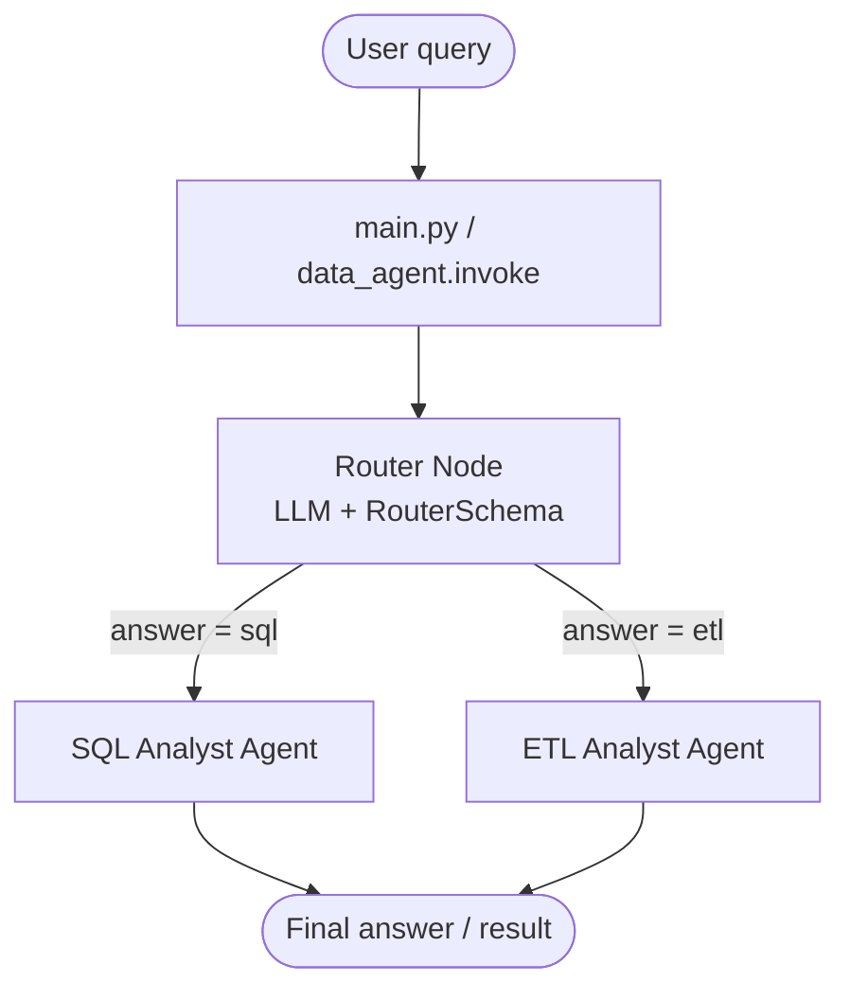
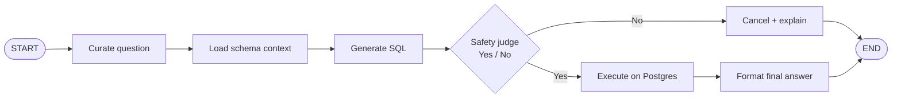
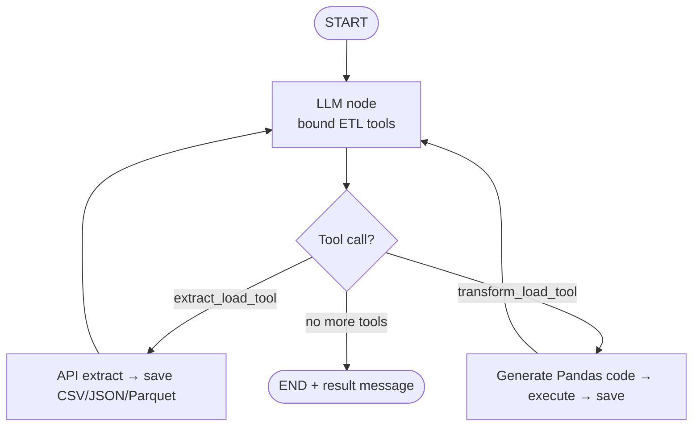
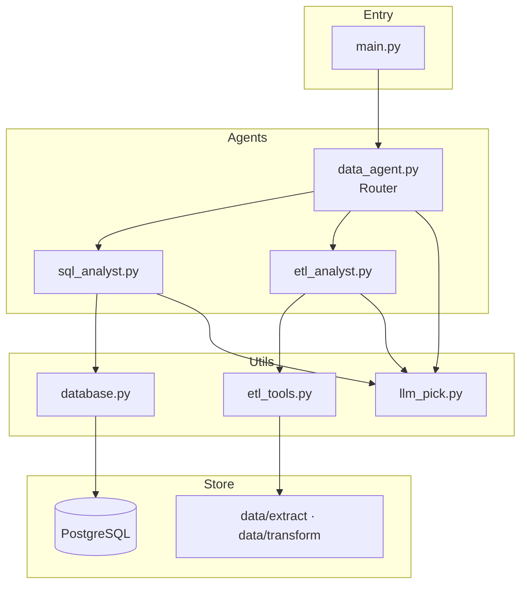

# QueryMesh

Multi-agent system that turns natural language into **SQL queries** or **ETL jobs**, orchestrated with [LangGraph](https://langchain-ai.github.io/langgraph/).

---

## What it does

You ask a question in plain English. A router agent classifies it as **SQL** or **ETL**, then hands it to a specialized sub-agent:

| Intent | Agent | What happens |
|--------|--------|--------------|
| Analytics / DB questions | SQL Analyst | NL → SQL → safety check → Postgres → answer |
| Extract / transform / load | ETL Analyst | Tool call → API extract or Pandas transform → files under `data/` |

---

## Project flow

### End-to-end (router)



### SQL Analyst path



### ETL Analyst path



### Component map



---

## Quick start

### Prerequisites

- Python **3.12+**
- PostgreSQL
- Anthropic and/or OpenAI API keys

### Setup

```bash
cd QueryMesh
python -m venv .venv

# Windows
.\.venv\Scripts\Activate.ps1
# macOS / Linux
source .venv/bin/activate

pip install -e .
# or: uv pip install -r requirements.txt
```

Copy `.env.example` to `.env` and fill in keys + DB settings:

```env
ANTHROPIC_API_KEY=...
OPENAI_API_KEY=...
host=localhost
port=5432
user=postgres
password=your_password
database=querymesh_db
ANALYTICS_HOST=localhost
ANALYTICS_PORT=5432
ANALYTICS_USER=querymesh_ro
ANALYTICS_PASSWORD=your_password
ANALYTICS_DATABASE=querymesh_db
REDIS_URL=redis://localhost:6379/0
ETL_URL_ALLOWLIST=https://pokeapi.co/
```

Load sample CSVs into Postgres (optional, for SQL demos):

```bash
python feed_db.py
```

Run a single question from the terminal (same function the API uses):

```bash
python main.py "Average rating per vehicle type"
```

Or serve the HTTP API:

```bash
uvicorn api.app:app --reload
```

`POST /api/v1/agent/query` with `{"question": "..."}`. Interactive docs are at `/docs`. Liveness is `GET /health`; Postgres readiness is `GET /ready`.

### Programmatic usage

```python
from agents.data_agent import data_agent
from langchain_core.messages import HumanMessage

response = data_agent.invoke({
    "messages": [HumanMessage(content="Show me the top 5 users by rating")],
    "route_response": "",
})
print(response)
```

---

## Project structure

```
QueryMesh/
├── agents/
│   ├── data_agent.py      # Router graph (SQL vs ETL)
│   ├── sql_analyst.py     # NL → SQL pipeline
│   └── etl_analyst.py     # Extract / transform tools
├── Models/
│   └── schema.py          # Pydantic state + router/judge schemas
├── utils/
│   ├── database.py        # Postgres helpers
│   ├── etl_tools.py       # Extract, transform, code exec
│   └── llm_pick.py        # Complexity-based LLM selection
├── data/                  # Sample CSVs + extract/transform outputs
├── main.py                # CLI entry
├── feed_db.py             # Seed DB from CSVs
├── PRODUCTION_ROADMAP.md  # Path to production hardening
├── docs/                  # Production work packets (start at docs/README.md)
└── pyproject.toml
```

---

## Agents in brief

**Router (`data_agent`)** — structured output (`sql` | `etl`) then conditional edge to a subgraph.

**SQL Analyst** — curate → schema prompt → generate SQL → LLM safety judge → execute or cancel → answer.

**ETL Analyst** — tool-calling loop with:

- `extract_load_tool` — HTTP API → file
- `transform_load_tool` — Pandas code gen + execute → file

LLM complexity is selected via `pick_llm("low" | "medium" | "claude")`.

---

## Example queries

| Query | Route |
|-------|--------|
| “Average rating per vehicle type” | SQL |
| “Extract https://pokeapi.co/api/v2/pokemon to `data/extract` as CSV” | ETL |
| “Filter `rides.csv` to rating &gt; 4 and save as JSON under `data/transform`” | ETL |

---

## Security note

This repo is a **tutorial / demo**. SQL safety today relies on an LLM judge (not a hard allowlist). Generated ETL Python runs in a worker child process (path jail, no network, URL allowlist on extract). Agent SQL uses `ANALYTICS_*`, not the primary `host` settings. Set `REDIS_URL` before running `python -m workers.etl_worker`. See [`PRODUCTION_ROADMAP.md`](./PRODUCTION_ROADMAP.md).

---

## Stack

LangChain · LangGraph · Anthropic / OpenAI · PostgreSQL · Pandas · Pydantic

**Version:** 0.1.0
